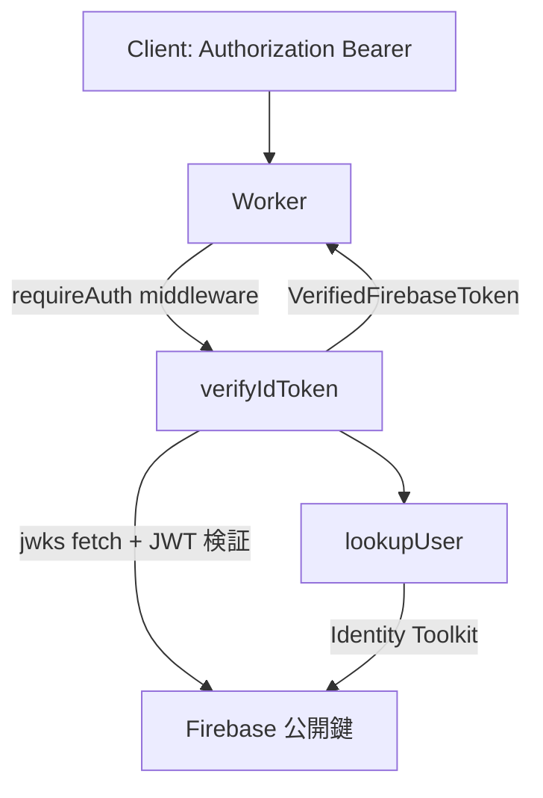

# JWT とトークン運用の全体像

このドキュメントでは、Cloudflare Workers ベースのバックエンドで JSON Web Token (JWT) がどのように使われているかをまとめます。`/src` 以下の実装(とくに `firebase.ts`、`lib/googleAccessToken.ts`、`middleware/auth.ts`、`routers/*`)を前提にしています。

## 1. 用語整理

- **ID トークン**: Firebase Authentication が発行する JWT。ユーザーのログイン状態を表し、クライアント ⇔Worker 間で Bearer 認証に使用。
- **リフレッシュトークン**: ID トークンの有効期限(通常 1h)を超える前に `/api/auth/refresh` で新しい ID トークンを取得するためのトークン。
- **サービスアカウント JWT アサーション**: Worker が Google OAuth に対してアクセストークンをリクエストする目的で署名・送信する JWT。`lib/googleAccessToken.ts` で生成。
- **アクセストークン**: Firestore REST API を呼び出す際に必要な OAuth2 bearer token。サービスアカウントの資格情報から取得し、Worker だけが利用。

## 2. ログイン〜認証フロー

```mermaid
graph TD
    A[Client: email+password] -->|/api/auth/login| B[Worker]
    B -->|Firebase Identity Toolkit REST| C[Firebase]
    C -->|ID token + refresh token| B
    B -->|JSON response (tokens, user)| A
    A -->|store: idToken, refreshToken| A
```

1. クライアントは `/api/auth/login` にメールアドレス・パスワードを送り、Worker が `signInWithPassword` (`firebase.ts`) を呼び出す。
2. Firebase Identity Toolkit から返ってくる ID トークンは Firebase 発行の JWT。このままクライアントに返す。
3. クライアントは ID トークンを Bearer として API リクエストの `Authorization` ヘッダーに付与する。リフレッシュは `/api/auth/refresh` で行い、ID トークンの再発行を受ける。

## 3. Worker 内での ID トークン検証



- すべての保護されたルート(`users/*`, `groups/*`, `scouts/*`)は最初に `middleware/auth.ts` の `requireAuth` を通る。
- `Authorization` ヘッダーから ID トークンを取り出し、`verifyIdToken` (`firebase.ts`) が Google の JWK セットを使って JWT を検証する。
- JWT の `sub` とフェッチしたユーザーレコードの UID が一致するか確認。問題があれば `FirebaseAuthError` を送出。
- 正常なら `VerifiedFirebaseToken` をコンテキストにセットし、ハンドラ内で利用できるようにする。

## 4. Firestore REST 呼び出しとサービスアカウント JWT

```mermaid
graph TD
    A[Worker] -->|FirestoreClient| B[getServiceAccountAccessToken]
    B -->|SignJWT (service account key)| C[JWT assertion]
    C -->|token endpoint| D[https://oauth2.googleapis.com/token]
    D -->|access_token| B
    B -->|Bearer| E[Firestore REST API]
```

- Worker が Firestore にアクセスする際、ユーザーの ID トークンをそのまま使うことはできない。サーバー側の管理権限が必要なため、サービスアカウント資格情報を Cloudflare Secrets として保持。
- `lib/googleAccessToken.ts` がサービスアカウントの秘密鍵で `SignJWT` を行い、JWT アサーションを作成して Google OAuth トークンエンドポイントへ送信。
- 返ってきたアクセストークンを 1 時間キャッシュし、`FirestoreClient` が Bearer として Firestore REST API へ渡す。
- これにより、データベース操作は Worker 側で完結し、フロントから直接 Firestore に触れる必要がなくなる。

## 5. クライアント側のトークン管理

- クライアントは ID トークンとリフレッシュトークンを保持。
- API 呼び出し時に ID トークンが失効した場合は `/api/auth/refresh` をコールし、Worker 経由で Secure Token API を叩いて新しい ID トークンを取得。
- 更新された ID トークンを使って再度 API を呼ぶ。

## 6. セキュリティ上のポイント

- ID トークンはユーザーの認可範囲を表す JWT。漏えいすれば一定時間 API が許可されてしまうため、HTTPS 通信とストレージ保護が必須。
- サービスアカウントの秘密鍵は Cloudflare Secrets で管理し、リポジトリやクライアントに晒さない。
- `FirebaseAuthError` を通じて HTTP ステータスを正規化し、失効/未認証/認可無しを明確にハンドリングしている。
- Firestore REST 呼び出しが失敗した際も `FirestoreClient` が例外を投げ、上位で捕捉して統一されたエラー応答を返す設計。

## 7. まとめ

1. ユーザー認証: Firebase が発行する **JWT(ID トークン)** をクライアント ⇔Worker の認証情報として使う。
2. Worker 認証: Worker 自身が Firestore を操作するために **サービスアカウントの JWT アサーション** を使ってアクセストークンを取得する。
3. どちらも JWT を基盤にしているが、目的(ユーザー認証 vs サーバー認可)と利用先が異なる。

これにより、Front は Firebase SDK なしで Worker の REST API だけで完結し、バックエンド側での権限管理とデータアクセス制御を強固にできる。
